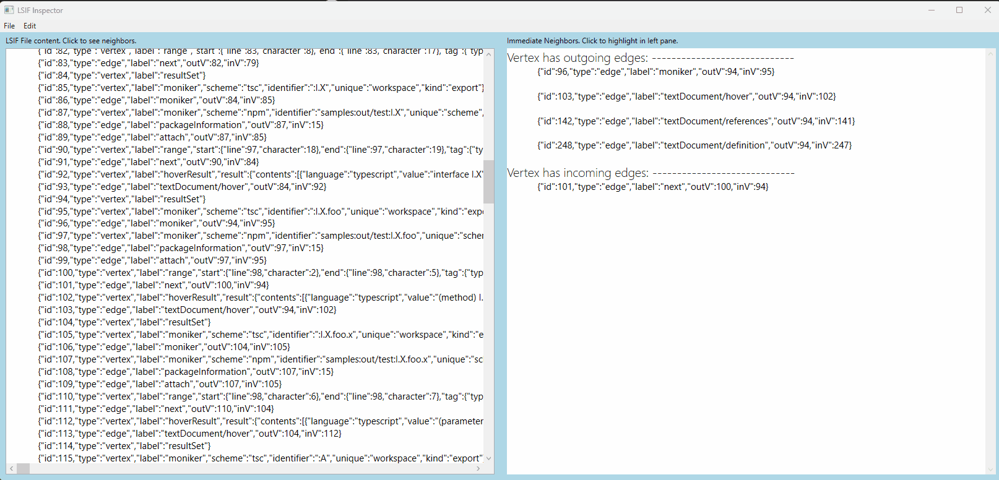

# LSIF Inspector

LSIF inspector is a trivial, hacky WPF application for browsing files in Microsoft's [Language Server Index Format](https://microsoft.github.io/language-server-protocol/overviews/lsif/overview/).

It implements support for click-based traversal of the LSIF graph. Simply open a file, click a row to see its neighbors, and click a neighbor to traverse the graph.

## Other useful resources

- [Language Server Index Format Spec](https://microsoft.github.io/language-server-protocol/specifications/lsif/0.6.0/specification/) - Describes the specification for LSIF.
- ['lsif-debug' command line tools](https://github.com/nTaylorMullen/lsif-debug) - Command line tool for various LSIF validation and debugging workflows.
  - 'visualize' - Opens a workspace in VS Code, using LSIF to power language features.
  - 'flatten' - Transforms LSIF to be more human readable and/or determinisitic, enabling easier text-based inspection and even diffing of two LSIF files to see what changed.

## Capabilities
- File > Open arbitrary LSIF files.
- Indent LSIF content by project and document begin and end `$event` scopes.
- Highlight edges and vertexes in different colors to help distinguish them.
- Ctrl+F / Find to search the left pane text.
- Display incoming/outgoing edges/vertexes for edge/vertex in the right pane.
- Click left or right pane to traverse the graph by stepping to the current edge or vertex' direct neighbor.

## Known issues
- Code quality - prototype quality. Could be better.
- UI thread - everything is done on the UI thread. Haven't taken the time to optimize.
- Find feature doesn't really work.

## Change Log
6/8/2023  - Performance improvements (update to AvalonEdit to enable usage with larger LSIF files).
4/28/2023 - Initial prototype version.